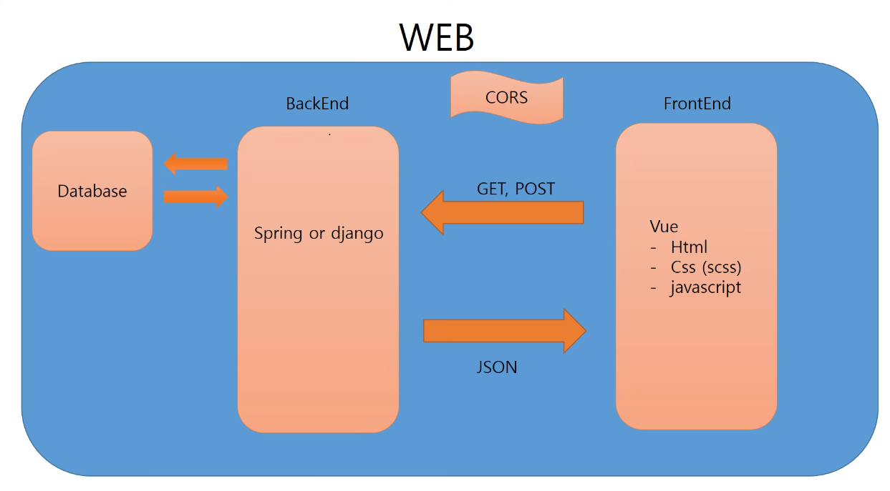

# get 방식과 post 방식의 차이

api를 요청할 때 호출하는 방식에 get, post 방식 두가지가 있다

백엔드에서 controller에서 데이터가 필요한 경우 데이터 베이스에 접속해서 json 형식으로 전달하면

프론트에서 가공한 데이터를 화면에 출력해줌

패킷은 헤더와 바디로 나눠짐. 데이터를 전달할 때 헤더 또는 바디에 넣어서 데이터를 전달하게 됨

get방식은 데이터를 헤더에 담아서 보내고(암호화 x) post는 바디에 담아서 보낸다(암호화 o)

post 방식은 get 방식보다 상대적으로 큰 데이터를 전송할 수 있어서, 큰 데이터를 전송할 때 get 방식보다는 post 방식으로 사용

GET방식과 POST방식의 차이에 대하여 설명하세요.-> GET방식과 POST방식의 가장 큰 차이점은 프론트엔드에서 백엔드로 데이터를 전송할 때 데이터를 헤더에 담아 전달하느냐 바디에 담아 전달하느냐의 차이입니다.POST방식의 경우 데이터를 바디에 넣어 보내기 때문에 기본적으로 암호화해서 전달하지만 GET방식은 암호화하지 않습니다.또한 POST방식은 GET방식보다 상대적으로 큰 데이터를 전송할 수 있어서 큰 데이터를 전송할 때에는 POST방식을 사용합니다.
