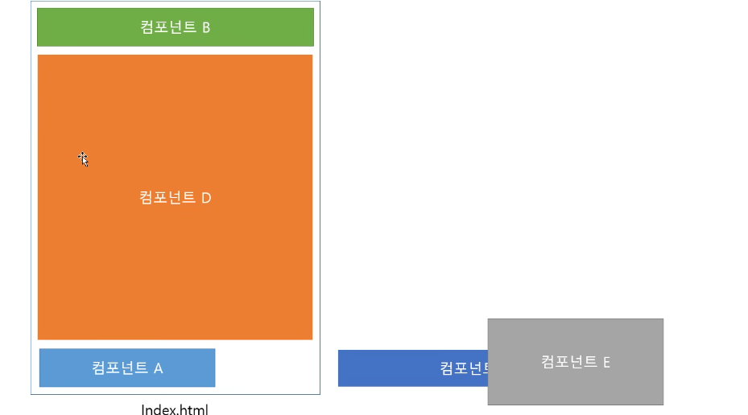
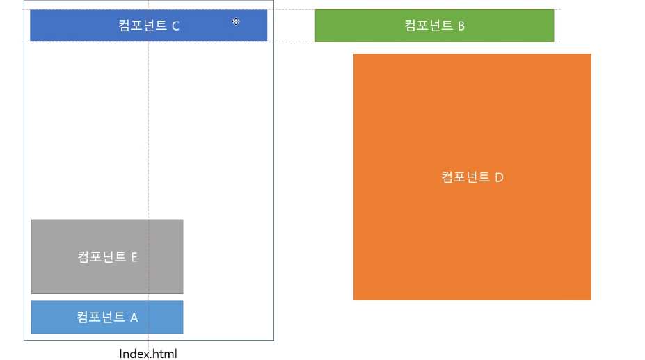

# spa 구조를 설명하세요.

하나의 페이지에 컨포넌트들의 배치를 다르게 하여 구성하는 방법

왜 중요하냐? 기존의 SPA가 아닌 경우에는 페이지가 모두 다르게 구성

SPA는 Single page application으로 기존 웹페이지를 개발할 때에는 각각의 페이지마다 뷰(View)파일을 가졌다면 SPA의 구조는 하나의 뷰(View)파일에 컴포넌트를 배치하는 방식으로 페이지를 구성하는 개념 입니다.
